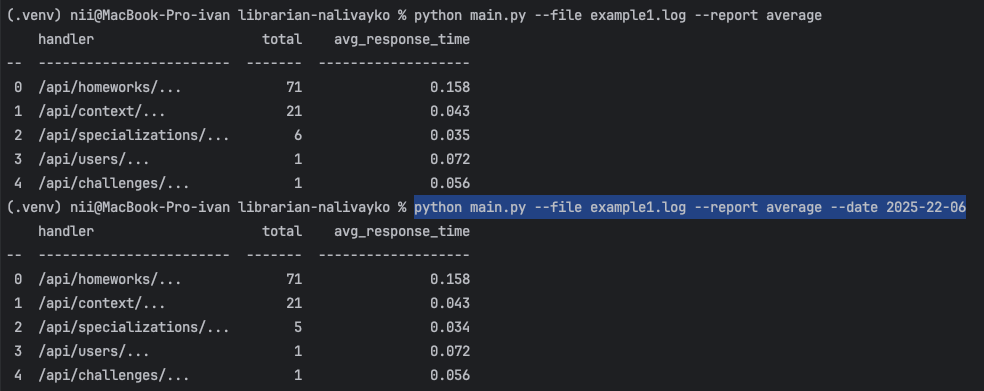
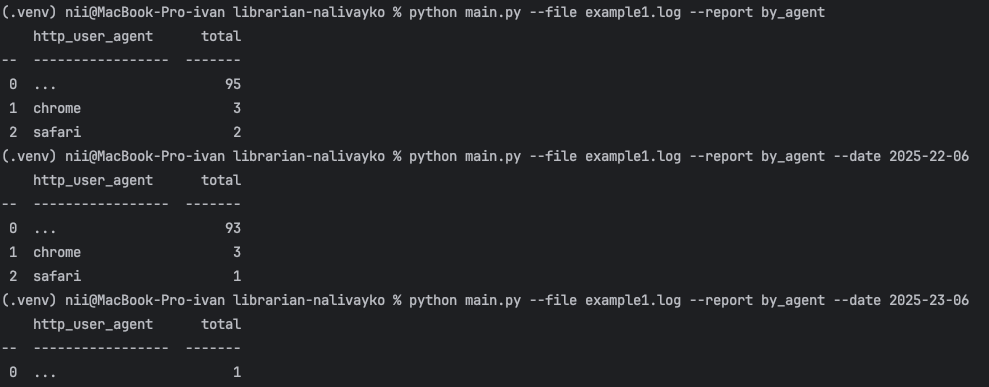
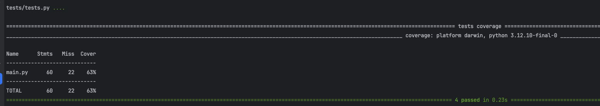

# work-mate
https://docs.google.com/document/d/1aJnkKaaVAl4nyjt_FRnxMSEt6n42pufxhMfXUCOiSCg/edit?tab=t.0

# установка зависимостей
```
pip install -r ./requirements.txt
```

# запуск скрипта
```
python main.py --file example1.log --report average 
python main.py --file example1.log --report average --date 2025-22-06
```



```
python main.py --file example1.log --report by_agent
python main.py --file example1.log --report by_agent --date 2025-22-06
```

# запуск тестов

```
 pytest --cov=main  tests/tests.py 
```

